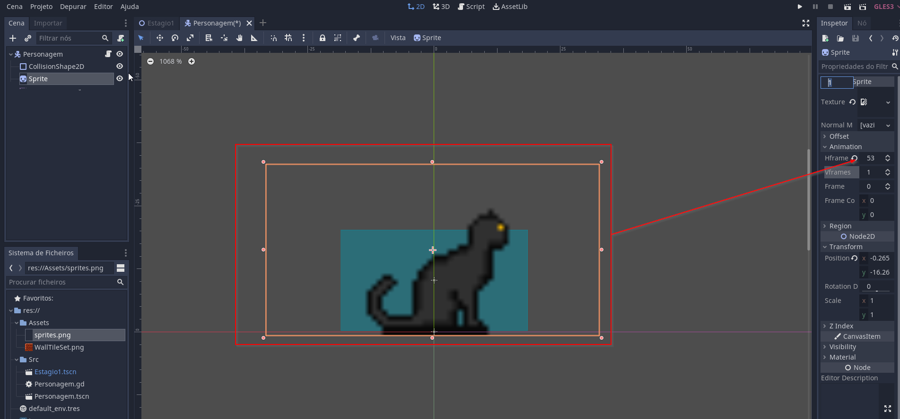
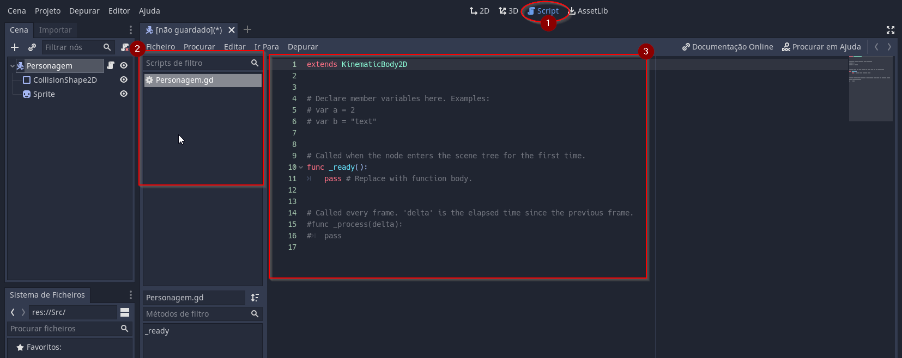
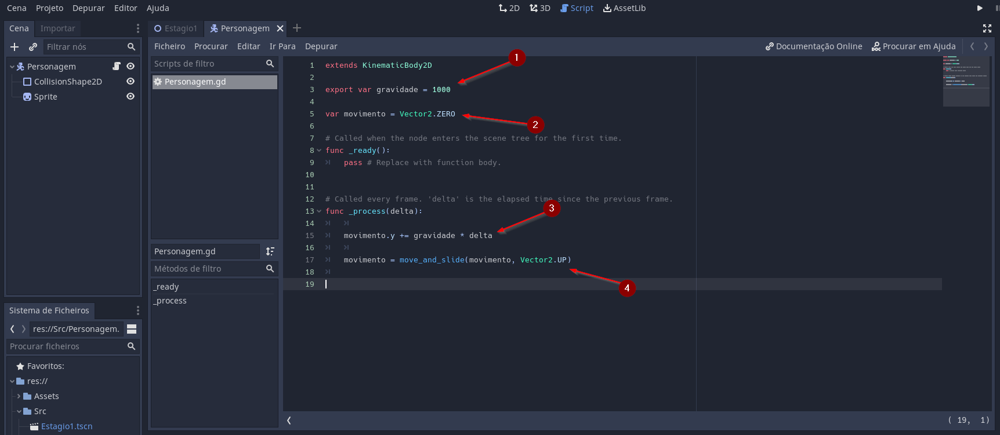
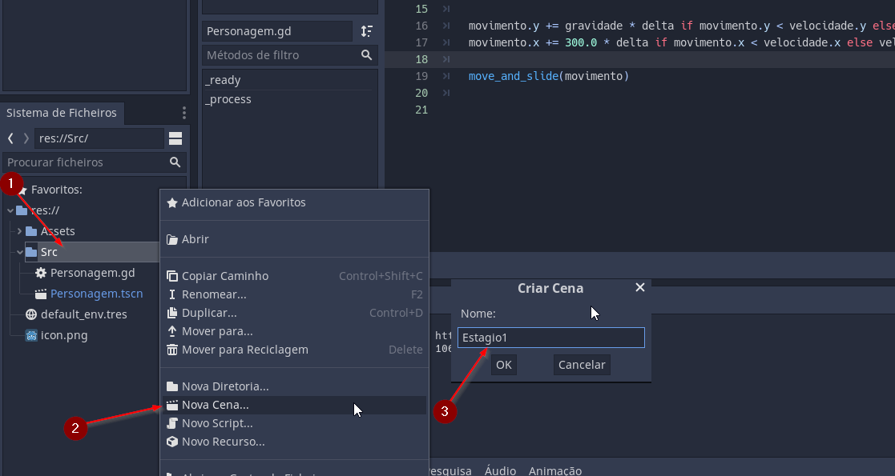
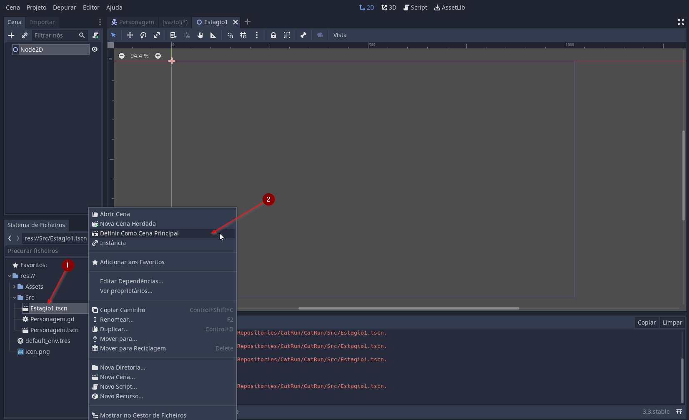
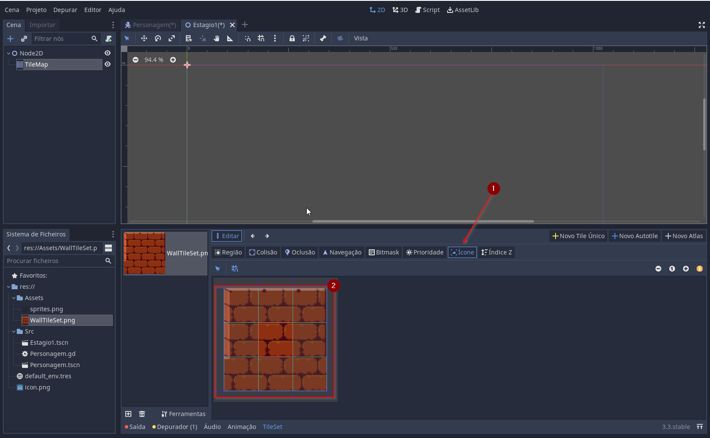
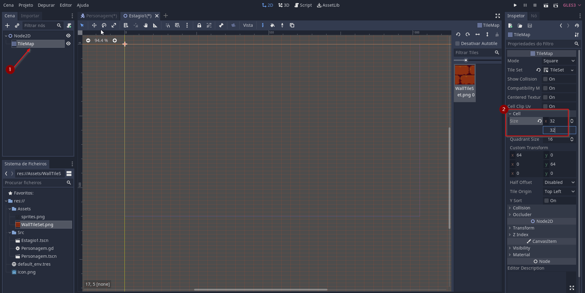
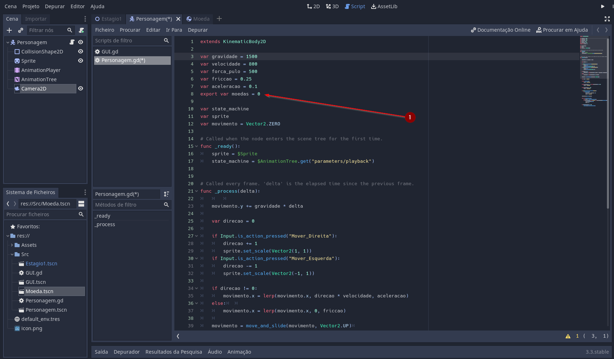
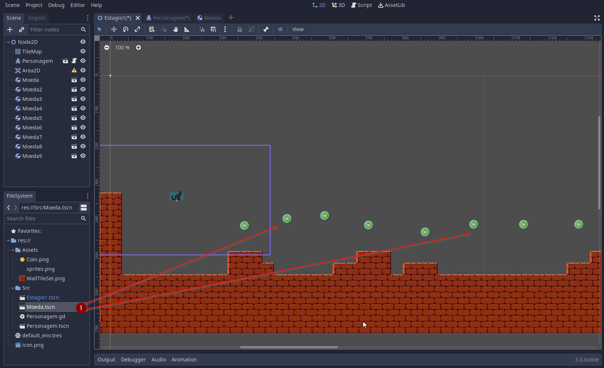

# workshop de desenvolvimento de jogos


## Pré-requisitos:

* **Godot Engine**
    Programa que usaremos para desenvolver nosso jogo, o Godot, que é um "Game engine" ou motor de jogo de código aberto, um programa que simplifica e abstrai o desenvolvimento de jogos.
    O Godot não precisa ser instalado, é só baixar, extrair e executar o programa (Ex. Godot_v3.3-stable_win64.exe), utilizaremos a versão mais 3.3, que é a mais recente.

    Baixe a versão mais recente clicando aqui: [Godot](https://downloads.tuxfamily.org/godotengine/3.3/Godot_v3.3-stable_win64.exe.zip).

    Para quem gosta de se aprofundar nas ferramente aqui esta a [documentação oficial em português ](https://docs.godotengine.org/pt_BR/stable/)

* **Sprites**
    Sprites são a arte que utilizaremos em nosso jogo, são desenhos do personagem em varias posições, desenhos do ambiente, etc.

    Os sprites que utilizaremos estão aqui: [Sprites](https://raw.githubusercontent.com/Kelvysb/CatRun/main/docs/Assets.zip).

* **Noções básicas de desenvolvimento**
    Para a parte logica do nosso jogo utilizaremos a linguagem de programação GDScript, linguagem baseada em Python, sendo assim noções básicas de desenvolvimento em Python são essenciais para o workshop, para  os iniciantes na área de desenvolvimento recomendo assistir alguns tutoriais básicos sobre Python.
    Recomendo este excelente curso gratuito de programação em Python: [Curso de Python](https://www.youtube.com/playlist?list=PLHz_AreHm4dlKP6QQCekuIPky1CiwmdI6)

* **Uma toalha**
    Essencial - uma toalha de sua preferência.

## Bonus

### Arte digital

Neste workshop não focaremos no processo artístico do jogo, mas caso deseje se aprofundar neste universo criativo, vou deixar aqui algumas recomendações.

* **PixelArt**

    no nosso jogo utilizaremos um estilo conhecido como PixelArt (ou Arte em pixels), este estilo remete ao jogos antigos, com um toque de modernidade, para iniciantes é um ótimo lugar para começão a desenvolver sua criatividade, e para os mais avançados pode se tornar um estilo desafiador, com inúmeras possibilidades.

    Um ótimo curso de PixelArt gratuito (em inglês): [Pixel art 101](https://www.youtube.com/playlist?list=PLmac3HPrav-9UWt-ahViIZxpyQxJ2wPSH)


    Programas que recomendo para criar PixelArt:

    - **Aseprite** - O mais completo editor especializado em PixelArt, possibilita criar imagens estáticas e animações, com um conjunto completo de ferramentas para ajudar no processo, e é muito fácil de se utilizar, pode ser encontrado no [site oficial](https://www.aseprite.org/) ou na [Steam](https://store.steampowered.com/app/431730/Aseprite/).

    - **Pyxel Edit** - Outro programa especializado em PixelArt, neste caso especificamente na criação de TileSets que são as partes que compõem os cenários, em uma versão futura do Aseprite esta funcionalidade estará presente de acordo com os desenvolvedores, mas por enquanto esta ainda e a melhor ferramenta para este proposito, pode ser encontrado no [site oficial](https://pyxeledit.com/).

    - **Paint** - Quem não tem colírio usa óculos escuros, caso esteja fácil de mais e você que  um desafio de outro nível, *PixelArt Raiz*


* **Arte 3D**
Para os que quiserem se aventurar no mundo da arte 3D, deixo antes das recomendações um aviso, as ferramentas são bem mais robustas e o processo é bem mais complexo, mas mesmo assim não menos apaixonante.
Programas:
    - Blender - Ferramenta de código aberto para modelagem 3D, pintura digital 3D e renderização, pode ser encontrado no site oficial [Blender](https://www.blender.org/).
    [Curso de Blender](https://www.youtube.com/playlist?list=PLrYLf1JihKtb5pbeR6fX1bMoREsjJn0Q_&ab_channel=DanielFranco)
    - Substance Painter - Ferramenta avançada para texturização de modelos 3D, um pouco cara, mas para quem quer avançar no mundo da arte 3D uma ferramenta essencial para obter resultados incríveis, não parece tão caro depois de ver o video de apresentação do programa, [Site oficial](https://www.substance3d.com/products/substance-painter/), no [Steam](https://store.steampowered.com/app/1454900/Substance_Painter_2021/)

## WorkShop

### **Criando um projeto**

* No gestor de projetos do Godot podemos escolher um projeto existente ou criar um novo clicando em 'Novo Projeto'(1), podemos então escolher o nome(3) de nosso projeto e a pasta onde o guardaremos(2), com o botão 'Criar Pasta' (4) será criada uma pasta vazia com o nome de nosso projeto. finalmente podemos clicar em 'Criar e Editar' (5).


* Na tela principal do Godot podemos identificar as partes mais importantes que utilizaremos:
    * 1 - O Modo, nele podemos escolher como visualizaremos a nossa cena, em 3D, em 2D ou visualizar nossos scripts.
    * 2 - O Viewport, ele e nosso espaço de trabalho aonde montaremos nossas cenas e scripts.
    * 3 - Visualizador de cena, aqui podemos ver os elementos que compõe nossa cena, adicionar novos nós, remover nós, reordenar, etc.
    * 4 - Sistema de arquivos, aqui visualizamos onde estão guardados os arquivos de nosso projeto, por aqui podemos adicionar novas cenas e atores, bem como usar os assets (Imagens, sons, etc.).
    * 5 - Inspetor, aqui podemos alterar as propriedades dos nós que selecionamos visualizador de cenas.
    * 6 - Controle de jogo, aqui podemos testar nosso jogo.

* Primeiramente vamos copiar para a pasta e nosso projeto os assets, podemos fazer isso no próprio explorador de arquivos do windows o Godot vai identificar a pasta nova e vai importar para o projeto os assets.

* E por fim vamos criar uma pasta chamada 'src' (source) on guardaremos nossas cenas, atores e scripts.


### **Criando um personagem**
* Para criar nosso personagem vamos ate o visualizador de cenas, e clicaremos em Outro nó, na janela que aparecerá podemos procurar por 'KinematicBody2D', essa será a base para nosso personagem (ator).

* Agora podemos salvar nosso personagem com 'CTRL+S' para isso escolhemos como pasta de destino a pasta 'src' que criamos a pouco.


* No visualizador de cenas podemos renomear nosso ator de 'KinematicBody2D' para 'Personagem' para facilitar nossa visualização.
Com o nó do personagem selecionado podemos clicar no botão '+' para adicionar um novo sub-nó ao nosso ator, procuraremos por 'CollisionShape2D', que será responsável a dar uma forma física ao nosso personagem.

* Com o 'CollisionShape2D' selecionado podemos ir ao 'inspetor' do outro lado da tela, e selecionar uma forma para nosso 'CollisionShape2D', no caso escolheremos um retângulo.

* Agora com o nó do personagem selecionado clicaremos mais uma vez no botão '+' para adicionar um nó chamado 'Sprite' este é responsável por dar uma representação gráfica ao nosso ator.

* com o 'Sprite' selecionado podemos ir a nossa pasta d3e assets e arrastar o arquivo chamado 'sprites.png' até o inspetor no campo 'Texture', com isso daremos esta textura ao nosso ator.

* Porem esta textura contem toda a animação de nosso personagem, então temos que dizer no inspetor que esta imagem e uma composição, parta isso iremos ate a aba 'Animation' e mudaremos o valor ede 'HFrames' para 53, indicando que nosso arquivo de sprites e composto por 53 imagens dispostas na horizontal.


* Agora selecionando o nó 'CollisionShape2D' podemos visualizar o formato de do retângulo de colisão que dará ao nosso ator a sua forma física, podemos redimensiona-lo ate ele ficar um pouco menor que a imagem do sprite.


* Agora por fim podemos posicionar tanto o 'Sprite' quanto o 'Collisionshape2D' para que ambos fiquem imediatamente acima da linha vermelha (x) do 'viewport'.


* **Programando o personagem**

* Com nosso personagem selecionado podemos clicar no botão de adicionar script (2), e com isso criar um script relacionado a ele.

* Com isso podemos selecionar o modo script(1) para visualizar nosso código, inicialmente ele estará vazio apenas com uma função '_ready()', e mais uma função comentada '_process(delta)' que des-comentaremos e utilizaremos logo em seguida.


* Agora podemos adicionar nosso primeiro código, que será responsável por adicionar gravidade ao nosso ator.

```python
extends KinematicBody2D

export var gravidade = 1500

var movimento = Vector2.ZERO

# Called when the node enters the scene tree for the first time.
func _ready():
    pass


# Called every frame. 'delta' is the elapsed time since the previous frame.
func _process(delta):

	movimento.y += gravidade * delta

	movimento = move_and_slide(movimento, Vector2.UP)
```

* A variável 'gravidade'(1) guardará o valor da força que a gravidade terá sobre nosso ator,
* já a variável 'movimento' (2) guardara a direção e força do movimento, iniciaremos ela com o valor ZERO (Vector2.ZERO) que contem valoes zerados para 'x' e 'y'.
* Na função '_process(delta)' incluiremos o acumulo de velocidade no eixo 'y' relacionado a gravidade, sempre multiplicando pelo parâmetro 'delta' que é a diferença de tempo entre os frames isso fará com que o movimento seja constante independente da velocidade do computador que o jogo estiver sendo executado.
* Por fim chamaremos a função 'move_and_slide(movimento, Vector2.UP)', que é responsável por executar o movimento, o primeiro parâmetro e o movimento em si, e o segundo e para indicar ao Godot que a direção que consideramos para cima é 'UP' ou seja eixo 'y' para cima.



* Podemos então testar nosso jogo e veremos um gato caindo no canto da tela.
(ao clicar em 'Play' pela primeira vez o Godot perguntara qual a cena principal, basta selecionar o arquivo de nosso Personagem (Personagem.tscn))


### **Criando uma cena**
* Agora precisamos criar uma cena para que nosso ator possa interagir.
Primeiro vamos no explorador de arquivos e vamos clicar com o botão direito na pasta 'src', e logo em seguida em 'Nova Cena', colocaremos o nome de 'Estagio1', em seguida no visualizador de cena escolheremos 'Cena 2D'



* Depois de salvar nossa cena podemos clicar com o botão direto sobre ela no explorador de arquivos, para defini-la como cena principal, assis nosso jogo se iniciará por ela.

* Agora vamos adicionar algo nesta cena, com o 'Node2D' selecionado no visualizador de cenas, vamos adicionar um nó chamado 'TileMap'.

* Com o 'TileMap' selecionado vamos no inspetor adicionar um novo 'TileSet', clique mais uma vez no 'TileSet' para abrir a janela de edição de TileSet.

* Arraste o 'WallTileSet.png' para area indicada (1).

* Selecionamos nosso TileSet(1) e clicaremos em 'Novo Autotile' (2).

* Clique em Região(1) e então no botão indicado (2), para subdividir nosso TileSet automaticamente em 9 partes iguais(3).

* Então vamos adicionar colisão ao nosso TileSet, basta clicar em 'Colisão' (1), então selecionar o tipo de colisão que adicionaremos, no cado será uma colisão retangular (2), então selecionamos a parte que desejamos adicionar a colisão e clicamos nela fazendo um movimento de arrastar para que a colisão preencha todo o quadrado selecionado (3). Repetimos o processo para todos os 9 quadrados.


* Agora em 'BitMask' (1), faremos um desenho para indicar ao Godot que partes são referentes aos cantos, a parte de cima, a parte do meio, etc. (2), basicamente quando queremos indicar que uma parte é um canto, selecionamos o canto oposto, como mostra a figura, quando queremos indicar que uma parte á superfície, marcamos um linha na parte inferior do quadrado, e por fim quando queremos indicar que faz parte do meio marcamos tudo, caso haja mais uma parte maraca da mesma maneira, o Godot desenhará estes tiles aleatoriamente, com uma proporção obedecendo a quantidade de tiles desenhados iguais, esta proporção pode ser mudada na aba 'prioridade'.


* Na aba 'Icone' selecionaremos o Tile principal, que no nosso caso será o tile do meio.


* Por fim com o 'TileMap' selecionado (1), vamos no inspetor alterar o tamanho do nossos tiles para 32 por 32 (2)

* Tendo feito estes passos basta agora desenhar nossa cena, adicionando chão, paredes e obstáculos, para apagar um tile basta clicar nele com o botão direito do mouse.

* Agora com o Node2D selecionado podemos a partir da nossa pasta 'src' arrastar nosso personagem (Personagem.tscn) para nossa cena(2).

* Agora ao testar nosso jogo o personagem não mais cairá para fora da tela, e sim parará no chão que desenhamos com nossos tiles.


### **Controlando o personagem**
Para controlar o personagem precisamos primeiramente dizer ao Godot quais são os comandos que o jogador poderá utilizar:
* No menu 'Projeto' (1) clicamos em 'Configurações do projeto' (2)
* Na janela de configurações do projeto vamos ate a aba 'Mapa de Entrada' (3).
* Nesta aba podemos adicionar novos comandos e associar teclas ou botões a estes commandos.
* No campo 'Ação'(3) vamos dar um nome a nosso comando, podemos acessar o camando no codigo usando este nome.
* então clicaremos em 'Adicionar'(4)

* O novo comando será adicionado no final da lista.
* Lá podemos adicinar a associação de teclas para nossa ação, clicando no '+'(2), en seguida clicando no tipo de comando que adicionaremos, no nosso caso será 'Tecla' (3).
* Uma janeça será mostrada aguardando a entrada no teclado(4).

Vamos adicionar os seguintes comandos e associações:
* 'Mover_Direita' - Teclas: 'D', 'Seta para direita'.
* 'Mover_Esquerda' - Teclas: 'A', 'Seta para esquerda'.
* 'Pular' - Teclas: 'W', 'Seta para cima', 'Barra de espaço'.

Agora vamos para nosso código, clicando na aba 'Scripts':
* Primeiramente vamos mudar um pouco nosso código, para lers os comandos e fazer com que nosso personagem se mova:
```Python
extends KinematicBody2D

export var gravidade = 1500
export var velocidade = 800

var movimento = Vector2.ZERO

# Called when the node enters the scene tree for the first time.
func _ready():
    pass


# Called every frame. 'delta' is the elapsed time since the previous frame.
func _process(delta):

	movimento.y += gravidade * delta

    movimento.x = 0

    if Input.is_action_pressed("Mover_Direita"):
		movimento.x += velocidade
	if Input.is_action_pressed("Mover_Esquerda"):
		movimento.x -= velocidade

	movimento = move_and_slide(movimento, Vector2.UP)
```
* Adicionamos uma variável chamada 'velocidade' que vai guardar o quão rápido será nosso personagem iniciaremos ela com o valor de 800.
* Então na função '_process(delta)', limparemos o valor x da variável movimento.
* adicionaremos as condições para mover no eixo 'x' baseado nos comandos 'Mover_Direita' e 'Mover_Esquerda', para acessar os comandos usamos a classe global do Godot 'Input' com a função 'is_action_pressed' que verifica se a ação esta pressionada.

Com isso nosso personagem poderá se mover para esquerda e para direita.

Agora vamos programar o pulo de nosso personagem:
* Vamos adicionar algumas coisas em nosso código:
```Python
extends KinematicBody2D

export var gravidade = 1500
export var velocidade = 800
export var forca_pulo = 400

var movimento = Vector2.ZERO

# Called when the node enters the scene tree for the first time.
func _ready():
    pass


# Called every frame. 'delta' is the elapsed time since the previous frame.
func _process(delta):

	movimento.y += gravidade * delta

    movimento.x = 0

    if Input.is_action_pressed("Mover_Direita"):
		movimento.x += velocidade
	if Input.is_action_pressed("Mover_Esquerda"):
		movimento.x -= velocidade

	movimento = move_and_slide(movimento, Vector2.UP)

    if Input.is_action_just_pressed("Pular"):
		if is_on_floor():
			movimento.y = forca_pulo * -1
			estado = "Pulando"
```

* Primeiro adicionaremos uma variavel para guardar a força do pulo, 'forca_pulo' e a iniciaremos com o valor de 400.
* Então adicionaremos  verificação se a tecla de pulo foi pressionada logo após o 'move_an_slide', usando a função do 'Input', 'is_action_just_pressed'
* Fazemos mais um checagem com a função do 'KinematicBody2D', 'is_on_floor()', que verifica se o personagem esta no chão, para que ele so pule se estiver no chão.
* Por fim colocamos a força do pulo na eixo 'y' do movimento, multiplicando por '-1', pois no Godot o eixo 'y' aumenta para baixo, ou seja e invertido.


Com isso nosso personagem pode agora pular.


Mas este movimentop não parece natural, ele começa a se mover instataneamente e para instantaneamente, vamos adicionar algo para resolver isso, atrito e aceleração:

* Primeiro vamos modificar um pouco nosso código:

```Python
extends KinematicBody2D

export var gravidade = 1500
export var velocidade = 800
export var forca_pulo = 500
export var atrito = 0.25
export var aceleracao = 0.1

var movimento = Vector2.ZERO

# Called when the node enters the scene tree for the first time.
func _ready():
	pass

# Called every frame. 'delta' is the elapsed time since the previous frame.
func _process(delta):

	movimento.y += gravidade * delta

	var direcao = 0

	if Input.is_action_pressed("Mover_Direita"):
		direcao += 1
	if Input.is_action_pressed("Mover_Esquerda"):
		direcao -= 1

	if direcao != 0:
		movimento.x = lerp(movimento.x, direcao * velocidade, aceleracao)
	else:
		movimento.x = lerp(movimento.x, 0, atrito)

	movimento = move_and_slide(movimento, Vector2.UP)

	if Input.is_action_just_pressed("Pular"):
		if is_on_floor():
			movimento.y = forca_pulo * -1
```

* Vamos adicionar 2 variáveis novas, 'atrito' e 'aceleração', com os valores 025 e 0.1 respectivamente.
* Então na nossa função vamos substituir a inicialização do 'movimento.x = 0' por uma declaração de variável: 'var direcao = 0'.
* E nas checagem das teclas pressionadas mudaremos o valor desta variável de acordo.
* Logo após checaremos se esta variável mudou de seu valor inicial '0'.
*  Caso sim, mudaremos o valor de 'movimento.x' de acordo coma direção, mas agora usando uma função global do Godot, chamada 'lerp', que nama mais e um modo de fazer os valores mudarem de maneira progressiva, baseado em uma aceleração. (lerp significa 'linear interpolation', qua nada mais é que uma função que gera uma linha em um gráfico cartesiano como mostra a figura)
* Caso contrario, faremos algo parecido mas dessa vez invertendo a de aceleração para atrito, para assim o personagem desacelerar lentamente.


* **Animando o personagem**

Agora vamos Animar o personagem, começando pelo básico, vamos fazer nosso personagem olhar para direção certa quando se movimenta:
* se formos nas propriedade do Sprite (inspetor), veremos uma propriedade chamada 'size' que e referente ao tamanho de nossa sprite.
* Se mudarmos ela para '-1' no eixo 'x' vemos que nossa sprite passa a apontar pára o lado oposto.
* Utilizaremos isso no código para definir para onde nosso personagem esta apontando.


Em nosso código adicionaremos algumas coisas:
```Python
extends KinematicBody2D

export var gravidade = 1500
export var velocidade = 800
export var forca_pulo = 500
export var atrito = 0.25
export var aceleracao = 0.1

var sprite
var movimento = Vector2.ZERO

# Called when the node enters the scene tree for the first time.
func _ready():
	sprite = $Sprite

# Called every frame. 'delta' is the elapsed time since the previous frame.
func _process(delta):

	movimento.y += gravidade * delta

	var direcao = 0

	if Input.is_action_pressed("Mover_Direita"):
		direcao += 1
        sprite.set_scale(Vector2(1, 1))

	if Input.is_action_pressed("Mover_Esquerda"):
		direcao -= 1
        sprite.set_scale(Vector2(-1, 1))

	if direcao != 0:
		movimento.x = lerp(movimento.x, direcao * velocidade, aceleracao)
	else:
		movimento.x = lerp(movimento.x, 0, atrito)

	movimento = move_and_slide(movimento, Vector2.UP)

	if Input.is_action_just_pressed("Pular"):
		if is_on_floor():
			movimento.y = forca_pulo * -1
```
* Adicionaremos uma variável chamada 'sprite' que referenciará a Sprite de nosso personagem.
* Na função '_ready()' removeremos o 'pass', e adicionaremos a inicialização desta variável, com o valor de '\$Sprite', usamos o '\$' quando queremos acessar algum nó de nossa cena/ator.
* Por fim na checagem de direção na função 'func _process(delta)', colocaremos a alteração do size do sprite: 'sprite.set_scale(Vector2(1, 1))' para direita e 'sprite.set_scale(Vector2(-1, 1))' para esquerda.


Agora nosso personagem aponta para o lado o qual esta se movendo.


Agora sim vamos animar nosso personagem:
* Vamos adicionar um  novo nó ao nosso Personagem chamado 'AnimationPlayer'.


Ao Selecionar este nó teremos acesso ao painel de animação do Godot:
* Nele podemos adicionar todas as animações relativas ao nosso personagem.
* Clicaremos em 'Animação' (3) e logo em seguida em 'novo'(4).
* então escolheremos um nome para nossa primeira animação, no caso esta será 'Parado'.


* Agora podemos em clicar em 'Adicionar Pista'(1), para adicionar uma sequencia de animação.
* Escolheremos como tipo 'Pista de Propriedade'(2).
* Na janela que se abrir selecionaremos o Sprite(3), como nó que animaremos.
* Na janela seguinte selecionaremos 'Frame'(4) como a propriedade do 'Sprite' que animaremos.


* Na nossa nova pista mudaremos as seguintes propriedades:
    * Loop (1) - para que nossa animação seja executada em loop.
    * Tempo (2) - para que nossa animação tenha o tempo de 1 segundo.
    * Modo continuo(3) - para que nossa animação tenha uma transição continua.
* Na janela de animação podemos então clicar com o botão direito na pista para adicionar uma 'Chave'(4) na posição 0 segundos.


* Adicionaremos então mais uma chave na posição de 1 segundo(2).
* E com a segunda chave selecionada, vamos na janela de inspetor, e mudaremos a propriedade 'value'(3) para 9, indicando que nossa animação termina no frame 9.
* Então configuraremos esta animação com a principal clicando no botão(4).
* podemos agora testar nossa animação no botão 'play'(5)


Faremos isso agora para as seguintes animações:
* Andando:
    * Tempo 1 segundo.
    * Valor da chave inicial: 10
    * Valor da chave final: 25
* Correndo:
    * Tempo 1 segundo.
    * Valor da chave inicial: 26
    * Valor da chave final: 39
* Pulando:
    * Tempo 1 segundo.
    * Valor da chave inicial: 40
    * Valor da chave final: 52
    * Neste caso a animação não será em loop.


Agora adicionaremos o nó responsável por controlar nossas animações, ele se chama 'AnimationTree'.


Com ele selecionado, iremos no inspetor e mudaremos a propriedade 'Anim Player'(2) para nosso 'AnimationPlayer'(3).


E na propriedade 'Tree Root'(1), criaremos um 'Novo AnimationNodeStateMachine'(2).


* Ao salvar e clicar novamente no 'AnimationTree', será exibida a janela de edição de animationTree.
* No inpertor podemos marcar esta animation tree como ativa(2).


* Com a ferramenta 'seta' selecionada vamos clicar com o botão direto na area do editor.
* clicar em Adicionar Animação(1).
* E por fim adicionar nossas animações(2).


*Selecionaremos a animação Parado(1), e marcaremos ela como inicial(2).


* Com a ferramente transição(1) selecionada.
* Criaremos as transições de nossa animação como mostra a figura(2), para criar uma transição basta clicar e arrastar de uma animação parta a outra.


* Com a ferramenta 'seta'(1) selecionada, vamos alterar as propriedades de nossas transições.
* começando pela transição de Pulando para Parado, no inspetor, mudaremos a propriedade 'Switch mode'(3) para 'AtEnd'(4), e a propriedade 'Advance Condition' para 'Andando'.


Para as 3 transições da imagem, mudaremos a 'Advance condition' para 'Pulando'.


Para estas duas mudaremos para 'Andando'.


Para esta: 'Parado'.


E por fim para esta ultima: 'Correndo'


Agora vamos para nosso código:
```Python
extends KinematicBody2D

export var gravidade = 1500
export var velocidade = 800
export var forca_pulo = 500
export var atrito = 0.25
export var aceleracao = 0.1
export var moedas = 0

var state_machine
var sprite
var movimento = Vector2.ZERO

# Called when the node enters the scene tree for the first time.
func _ready():
	sprite = $Sprite
	state_machine = $AnimationTree.get("parameters/playback")


# Called every frame. 'delta' is the elapsed time since the previous frame.
func _process(delta):

	movimento.y += gravidade * delta

	var direcao = 0

	if Input.is_action_pressed("Mover_Direita"):
		direcao += 1
		sprite.set_scale(Vector2(1, 1))
	if Input.is_action_pressed("Mover_Esquerda"):
		direcao -= 1
		sprite.set_scale(Vector2(-1, 1))

	if direcao != 0:
		movimento.x = lerp(movimento.x, direcao * velocidade, aceleracao)
	else:
		movimento.x = lerp(movimento.x, 0, atrito)

	movimento = move_and_slide(movimento, Vector2.UP)

	var estado = "Parado"

	if not is_on_floor():
		estado = "Pulando"

	if abs(movimento.x) > 50 and abs(movimento.x) <= 400:
		estado = "Andando"

	if abs(movimento.x) > 400:
		estado = "Correndo"

	if Input.is_action_just_pressed("Pular"):
		if is_on_floor():
			movimento.y = forca_pulo * -1
			estado = "Pulando"

	state_machine.travel(estado)
```


* **Câmera**


a

* **Itens**





* **Score**


* **Reset**

