# workshop de desenvolvimento de jogos

## Pré-requisitos:

* **Godot Engine**
    Programa que usaremos para desenvolver nosso jogo, o Godot, que é um "Game engine" ou motor de jogo de código aberto, um programa que simplifica e abstrai o desenvolvimento de jogos.
    O Godot não precisa ser instalado, é só baixar, extrair e executar o programa (Ex. Godot_v3.3-stable_win64.exe), utilizaremos a versão mais 3.3, que é a mais recente.    

    Baixe a versão mais recente clicando aqui: [Godot](https://downloads.tuxfamily.org/godotengine/3.3/Godot_v3.3-stable_win64.exe.zip).

    Para quem gosta de se aprofundar nas ferramente aqui esta a [documentação oficial em português ](https://docs.godotengine.org/pt_BR/stable/)

* **Sprites**
    Sprites são a arte que utilizaremos em nosso jogo, são desenhos do personagem em varias posições, desenhos do ambiente, etc.

    Os sprites que utilizaremos estão aqui: [Sprites](/docs/sprites.zip).

* **Noções básicas de desenvolvimento**
    Para a parte logica do nosso jogo utilizaremos a linguagem de programação GDScript, linguagem baseada em Python, sendo assim noções básicas de desenvolvimento em Python são essenciais para o workshop, para  os iniciantes na área de desenvolvimento recomendo assistir alguns tutoriais básicos sobre Python.
    Recomendo este excelente curso gratuito de programação em Python: [Curso de Python](https://www.youtube.com/playlist?list=PLHz_AreHm4dlKP6QQCekuIPky1CiwmdI6)

* **Uma toalha**
    Essencial - uma toalha de sua preferência.

## Bonus

### Arte digital

Neste workshop não focaremos no processo artístico do jogo, mas caso deseje se aprofundar neste universo criativo, vou deixar aqui algumas recomendações.

* **PixelArt**

    no nosso jogo utilizaremos um estilo conhecido como PixelArt (ou Arte em pixels), este estilo remete ao jogos antigos, com um toque de modernidade, para iniciantes é um ótimo lugar para começão a desenvolver sua criatividade, e para os mais avançados pode se tornar um estilo desafiador, com inúmeras possibilidades.

    Um ótimo curso de PixelArt gratuito (em inglês): [Pixel art 101](https://www.youtube.com/playlist?list=PLmac3HPrav-9UWt-ahViIZxpyQxJ2wPSH)

    Programas que recomendo para criar PixelArt:

    - **Aseprite** - O mais completo editor especializado em PixelArt, possibilita criar imagens estáticas e animações, com um conjunto completo de ferramentas para ajudar no processo, e é muito fácil de se utilizar, pode ser encontrado no [site oficial](https://www.aseprite.org/) ou na [Steam](https://store.steampowered.com/app/431730/Aseprite/).

    - **Pyxel Edit** - Outro programa especializado em PixelArt, neste caso especificamente na criação de TileSets que são as partes que compõem os cenários, em uma versão futura do Aseprite esta funcionalidade estará presente de acordo com os desenvolvedores, mas por enquanto esta ainda e a melhor ferramenta para este proposito, pode ser encontrado no [site oficial](https://pyxeledit.com/).

    - **Paint** - Quem não tem colírio usa óculos escuros, caso esteja fácil de mais e você que  um desafio de outro nível, *PixelArt Raiz*

* **Arte 3D**
Para os que quiserem se aventurar no mundo da arte 3D, deixo antes das recomendações um aviso, as ferramentas são bem mais robustas e o processo é bem mais complexo, mas mesmo assim não menos apaixonante.
Programas:
    - Blender - Ferramenta de código aberto para modelagem 3D, pintura digital 3D e renderização, pode ser encontrado no site oficial [Blender](https://www.blender.org/).
    [Curso de Blender](https://www.youtube.com/playlist?list=PLrYLf1JihKtb5pbeR6fX1bMoREsjJn0Q_&ab_channel=DanielFranco)
    - Substance Painter - Ferramenta avançada para texturização de modelos 3D, um pouco cara, mas para quem quer avançar no mundo da arte 3D uma ferramenta essencial para obter resultados incríveis, não parece tão caro depois de ver o video de apresentação do programa, [Site oficial](https://www.substance3d.com/products/substance-painter/), no [Steam](https://store.steampowered.com/app/1454900/Substance_Painter_2021/)

## WorkShop

### O Godot

* **Criando um projeto**

* **Criando um personagem**

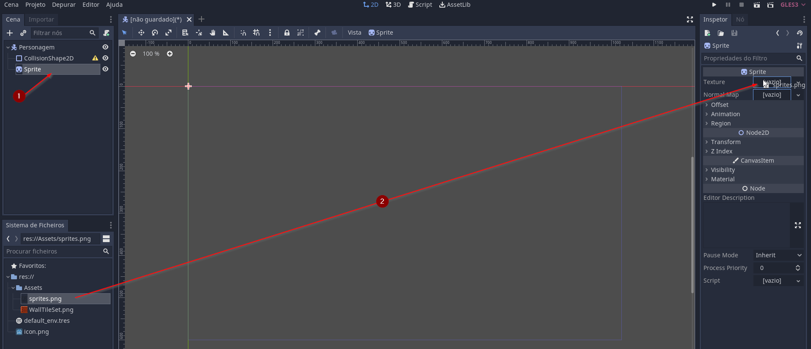
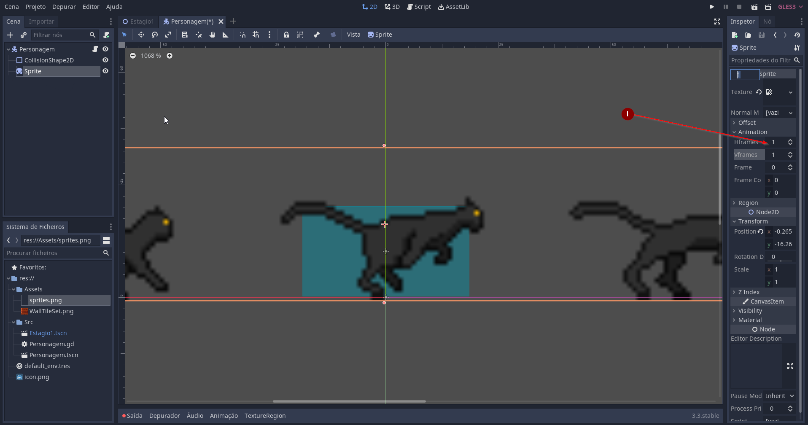

* **Programando o personagem**

Change

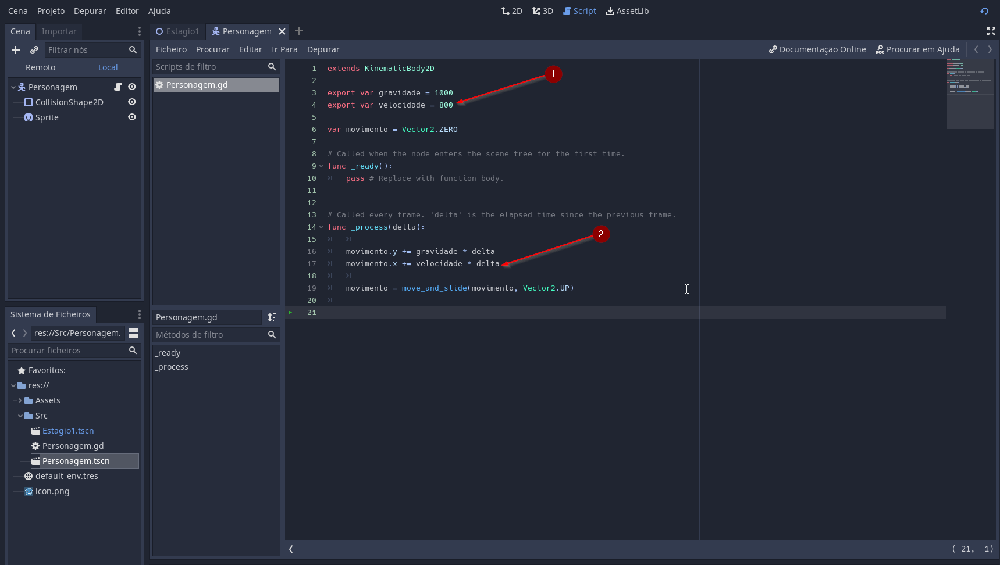
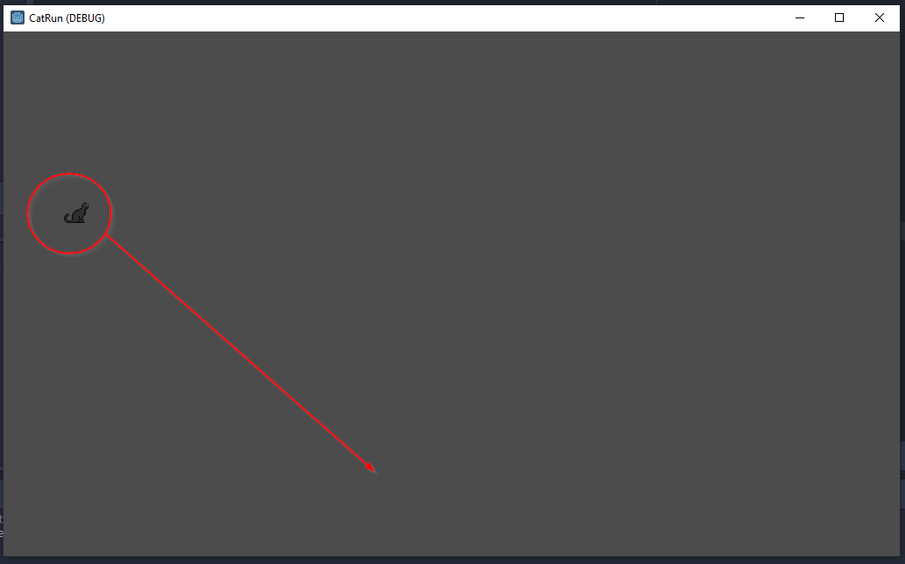

* **Criando uma cena**

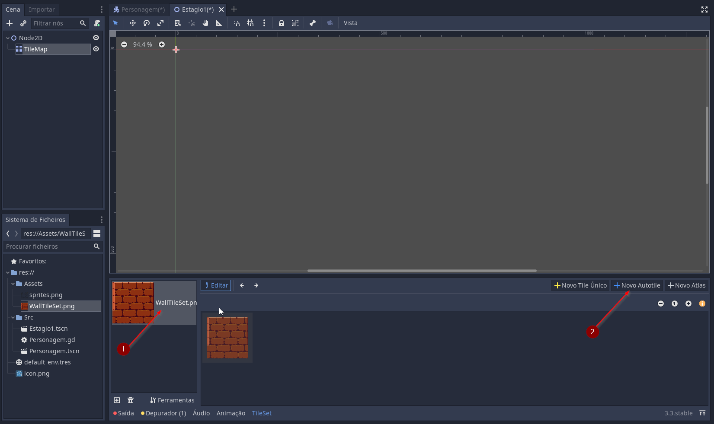

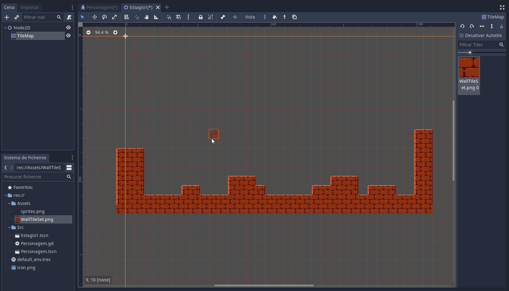

* **Controlando o personagem**

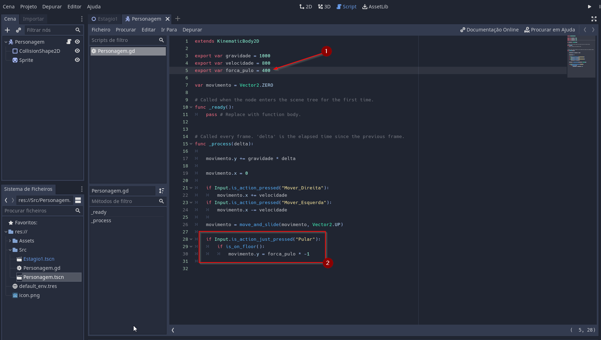

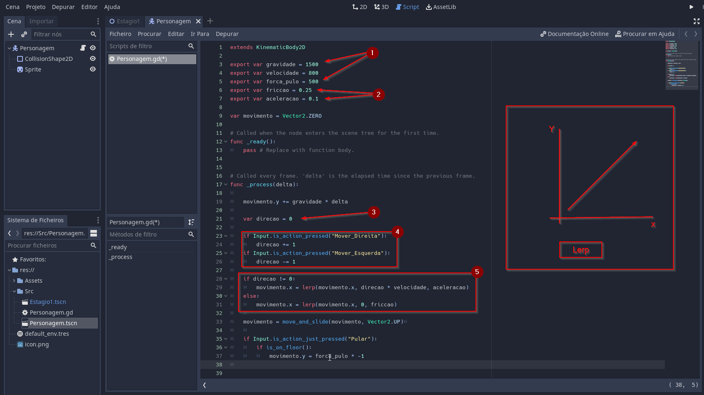

* **Animando o personagem**

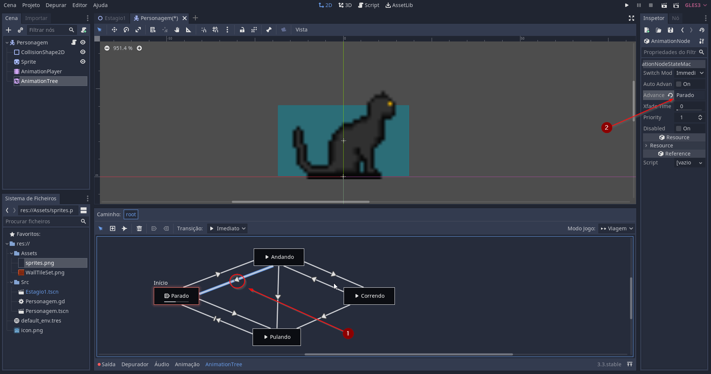

* **Câmera**

a

* **Itens**

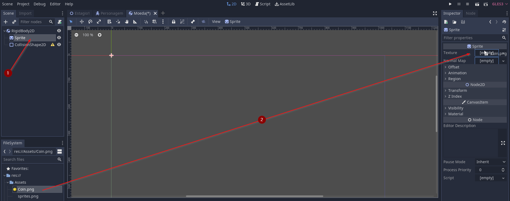
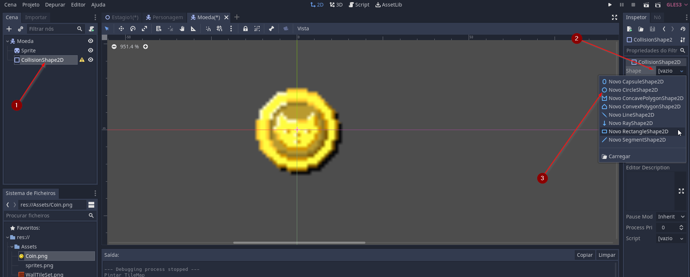

